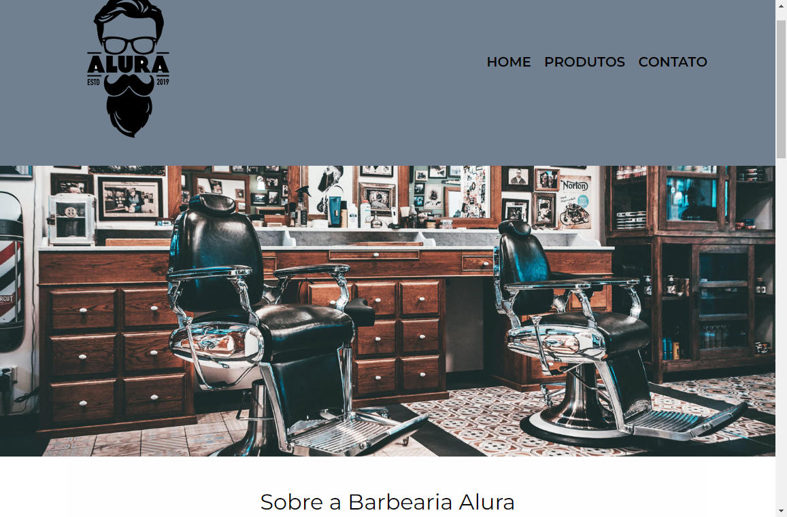

<h1 align = "center"> Barbearia Alura</h1>

 

<h2 align = "center"> Projeto construído em conjunto da Alura, é um sólido e responsivo site de 3 páginas aplicado a uma barbearia.</h2>

## 🎯 O que aprendi ?!
Aplicar responsividade, pseudo-elementos, background gradiente, incorporar fontes externas, etc... 

## ✔️ Tecnologias utilizadas 
> HTML 

> CSS 

> Git & Github

